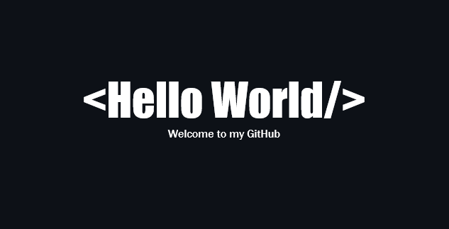

### О себе:

* Последние несколько лет занимаюсь разработкой на Java.
* В 2022 году прошел [Яндекс Практикум](https://practicum.yandex.ru/java-developer)
* В 2023 году прошел на основное обучение в [Школу 21](https://21-school.ru/we) от СБЕРа

 

### Стек технологий:

 

### Контакты

